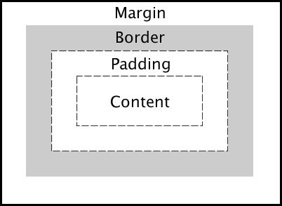

# CSS Layout

# Block vs Inline


## BLOCK ELEMENTS

A block-level element always starts on a new line, and the browsers automatically add some space (a margin) before and after the element. They are stacked in descending order.  

```<p>```,```<h1>```, and ```<div>``` and semantic elements like ```<header>``` and ```nav``` are  examples of block  level elements.

Notice the ```<p>``` elements go across the page. A block-level element always takes up the full width available, unless you change it. 


## Inline Elements

Notice that the ```<button>``` elements and the images are side by side, even though the html elements are stacked on top of each other in ```index.html```.

These are **In-line Elements** An inline element does not start on a new line. It only takes up as much width as necessary.  

``````,```<span>```, and ```<button>``` and  ```<a>``` (hyperlinks) are  examples of inline level elements.

When two in-line elements are next to each other, they appear side by side.

## Task 

You can use CSS to make **in-line** elements display as **block** elements.  Find the hyper links at the bottom of the page under **Further Reading**

In CSS, change the  display property of  the hyperlinks l ike this:

```
a {
  display: block;
}
```
Now each link is on it's own line.

## Float

You can use the **FLOAT** Property to position elements on a page.

According to [W3schools](https://www.w3schools.com/html/default.asp) The float property can have one of the following values:

**left** - The element floats to the left of its container<br>
**right** - The element floats to the right of its container<br>
**none** - The element does not float (will be displayed just where it occurs in the text). This is default<br>
**inherit** - The element inherits the float value of its parent<br>

The float property can be used to wrap text around images.

## Task 2

Go to the element ```<div class="bio">```

Position the picture to the right of the text in CSS like this:

```
.bio img {
  float: left;
}
```

## Clear

You'll notice that the **Childhood** section has been affected by floating the image to the left.

When we use the float property, and we want the next element below (not on right or left), we will have to use the clear property.

The clear property specifies what should happen with the element that is next to a floating element.

According to [W3schools](https://www.w3schools.com/html/default.asp), the clear property can have one of the following values:

**none** - The element is not pushed below left or right floated elements. This is default<br>
**left** - The element is pushed below left floated elements<br>
**right** - The element is pushed below right floated elements<br>
**both** - The element is pushed below both left and right floated elements
**inherit** - The element inherits the clear value from its parent<br>

## Task 3

To move the Childhood section below the photo in the Biography section, **match the direction** of the float above like this:

```
.childhood h3 {
  clear: left;
}

```

**REMEMBER**

If you **float** left, you have to the affected element to the left.

If you **float** right, you have to clear the affected element to the right.

## Task 4

Try Floating the image below the word **Childhood** to the right.  Then use the **clear** property to move the word **Education** below the **Childhood** section.


## Task 5

Float the image below the word **Legacy** to the **left**.  Then use the **clear** property to move the word **Source** below the **Legacy** section image and text.

# Box Model

Every HTML element is surrounded by a "box". That box will remain invisible until you add style with CSS.

## Task 6

In the ```index.html``` page, take a look at the ```<div class="header">``` element. In ```style.css``` go to the Change the background-color like this:

```
  .header {background-color: #16A085;
  }
```
You will see a colored box around the ```<div class="header">``` element. 

## Task 7

You will notice that the box stretches across the whole page. An HTML page is 1440 pixels (1440px) across. You can change the size of a box by **percentage** or **pixels**. 

Changing by pixels will look like this:

```
  .header {background-color: #16A085;
          width: 800px;
  }
```

We will change our ```<div class"header">``` box using percentage. We will make our box stretch across 75% of the entire page like this:

```
  header {background-color: #16A085;
          width: 75%;
  }
```

## Box Model Properties

The box actually consists of: margins, borders, padding, and the actual content. The image below illustrates the box model:



**Content -** The content of the box, where text and images appear.

**Padding -** Clears an area around the content. The padding is transparent

**Border -** A border that goes around the padding and content

**Margin -** Clears an area outside the border. The margin is transparent.

We can modify each of these using CSS.

## Task - Content

You can position the text content in an element by using ```text-align``` property.

**left**	Aligns the text to the left	
**right**	Aligns the text to the right	
**center**	Centers the text	
**justify**	Stretches the lines so that each line has equal width.

Align the text in the ```<div class="header">``` element like this:

```
  .header {background-color: #16A085;
          width: 75%;
          text-align: center;
  }
```

## Task - Centering Images in Div

There are many ways to center an image inside of a div.  We will change the display property and use ```margin: auto;``` like this:

```
 .header img {
    margin: auto;
    display: block;
  }
```

## Task 10 - Borders

There are many properties to think about with borders. The most common are width  (thickness), style and color. 

**border-width** is the thickness of the border.

**border-style** (required) is the appearance of the  border. Solid, dotted  and dashed are most common but there are many others.

**border-color**  is the color of the border.

**border-radius** rounds the corners of a border.

You can change border properties with separate rules.

```
  {
    border-width: 5px; 
    border-style: dashed; 
    border-color: green;
  }
```

You can change all three using a single border property 
by adding them in order (width, style, color) with a space inbetween.

```{ border: 5px solid  green}```

If you want to change the border of one side only, use:

```border-top```,```border-bottom```, ```border-left``` and ```border-right```

## Task 

Add a border to the image at the top like this:

```
  .header img {
      margin: auto;
      display: block;
      border: 2px double black;
  }
```
***You can choose your own border width, style and color***

## Task

You can create rounded borders using Border Radius. Let's change the border-radius of the header element like this:

```
  .header {
          background-color: #16A085;
          width: 75%;
          text-align: center;
          padding: 20px;
          border-radius: 12px;
  }
```


There is a wide variety of possibilities with border styling.  Here is a link to some of those possibilities:

[W3 Schools CSS Borders](https://link-url-here.org](https://www.w3schools.com/css/css_border.asp))

## Task - Padding

Padding is the space between the content and the border. Change the padding of the ```<div class="header">``` element like this:

```
  .header {
          background-color: #16A085;
          width: 75%;
          text-align: center;
          padding: 20px;
  }
```

This will add a 20px padding around all sides of the element.

## Task

Look at the image at the top of the page. Add some padding between the image and border like this:

```
  .header img {
      margin: auto;
      display: block;
      border: 2px double black;
      padding: 4px;
  }
```

You can also change the padding around a specific side by using these properties:

```padding-top```,```padding-bottom```, ```padding-left``` and ```padding-right```

Explore more padding style possibilities here:

[W3 Schools Padding](https://www.w3schools.com/css/css_padding.asp)

## Task 

Modify the ```<div class="navigation">``` element:

- Add a box around the ```<div class="navigation">``` element. Use this hex code for the background color: #27AE60.
- Center the content in the ```<nav>``` element.
- Add **20px** of **padding**
- Add a **border-radius** of **12px**

## Task 

Modify the ```<footer>``` element:

- Add a box around the ```<footer>``` element. Use this hex code for the background color: #16A085.
- Add **20px** of **padding**
- Add a **border-radius** of **12px**

## Task 

Modify the ```<div class="bio">```, ```<div class="childhood">```, and ```<div class="legacy">``` element:

- Add a box around the ```<footer>``` element. Use this hex code for the background color: #16A085.
- Add **20px** of **padding**
- Add a **border-radius** of **12px**

## Floating Images

Since the images in ```<div class="bio">```, ```<div class="childhood">```, and ```<div class="legacy">``` are **literally** floating the background color does not extend around them.

## Task

Add an overflow property to each ```div``` like this:

```
  {
    overflow: hidden;
  }
```

**Now the background-color wraps around the images. 

## Task - Centering a div

Add the following code to your ```<div class="header">```:

```
  {
    background-color: #16A085;
    width: 75%;
    text-align: center;
    padding: 20px;
    margin-right: auto;
    margin-left: auto;
  }
```

```margin-right: auto```  and ```margin-left: auto``` will center the entire div.

## Task

Center all of the divs.

## MARGINS

You'll notice that all of the boxes are touching. You can use margins to add space around an element.

Simply using ```margin``` as your CSS property like this will add space around all sides of your box:

```
  .header {
          background-color: #16A085;
          width: 75%;
          text-align: center;
          padding: 20px;
          border-radius: 12px;
          margin-right: auto;
          margin-left: auto;
          margin: 20px;
  }
```
Run the code. You will see a 20px margin around all sides of the element.

## Task

Add a ```20px``` ```margin``` to all of the other divs.

There are many ways to style margins. Explore more of these possibilities here:

[W3 Schools Margins](https://www.w3schools.com/css/css_margin.asp)

## Task 9

If you want to change the margin of one side only, use:

```margin-top```,```margin-bottom```, ```margin-left``` and ```margin-right```

Notice that the image in the biography section is touching the text. You can increase the margin to the right of the image to add space.

```
  .bio img {
    float: left;
    margin-right: 10px;
  }
  ```
Now you should see a space between the image in **biography** and the text.

## Task

Add some space between the image and text in the other divs.


## Task 11

You can center elements with a margin property by using ```margin:auto```

Add the property and value ```margin:auto``` to header, nav, main and footer in CSS.
